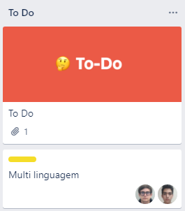
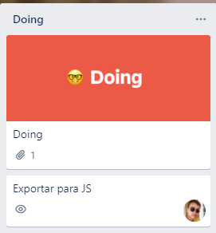
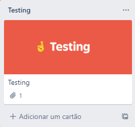

# Workflow

> 💡 This page documents the development process engineers should follow at your company. Helpful for getting new employees up to speed.

---

# 1. Create a remote branch off of `main`

💡 Prerequisite:
Ensure that your task is already written on the Trello Board and is on status **TO DO**.

Example:

💡 Name the branch with the following **convention**: [type of task]/[name of task]

Examples:

- `docs/updating-readme`
- `feat/footer-section`

# 2. Writing code

1. Pass your task on the Trello Board to **DOING**

1. Write the necessary code and commit to the branch created on the first step.
2. Commit your code to the database following the best practices.

   💡 Check the following article to learn more about the best practices while commit your code to git.

   [How to Write Better Git Commit Messages - A Step-By-Step Guide](https://www.freecodecamp.org/news/how-to-write-better-git-commit-messages/)

   💡 Git commits **must follow the** **convention**:
   `[type]:[description]`

   Examples:
   `fix: fix overflow on the navbar due the icon`
   `ci: implementing github actions pipeline to validate code`
   `feat: adding content section to the main page`

# 3. Create a pull request on GitHub

After performing all the necessary code to fulfill the functional requirements of the task open a pull request on the project, to merge from the branch where your work is present to the **Main** branch.

**Include the Trello task link in your PR description.**

💡 **VERY IMPORTANT:** Before making the pull request, merge the **MAIN** branch to the branch created on the first step to avoid merge conflicts, since it is very probable that someone pushed to the **MAIN** branch while you were developing on your separated branch.

💡 **Recommend Tutorial** :

[**How to make a Pull Request on Github**](https://www.youtube.com/watch?v=8lGpZkjnkt4)

# 4. Submit for review

1. Inform the creation of the PR on the appropriated on Microsoft Teams.

   💡 Message on pull-request channel with direct link to the pull request

2. Pass the task on the Trello Board to **TESTING**

   

3. In case of any comments on the pull request, fix based on provided feedback.

   💡 Message to show that an pull request has comments to fix

4. Commit your fixes in the **SAME** branch where the Pull Request was created and inform of the fix.

5. After the PR is approved ( informed on teams chat ), you have the permission to finalize the PR and merge the branch to **MAIN**.

   💡 Example of message of Approval

   > "Approved" || "LGTM" xd

6. Merge the pull request

   💡 After the pull request is merged, ensure that your branch created remotely is **deleted.**

   💡 Inform the team that you made the merge request.

7. Pass the task on the Trello to **DONE**
